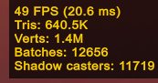
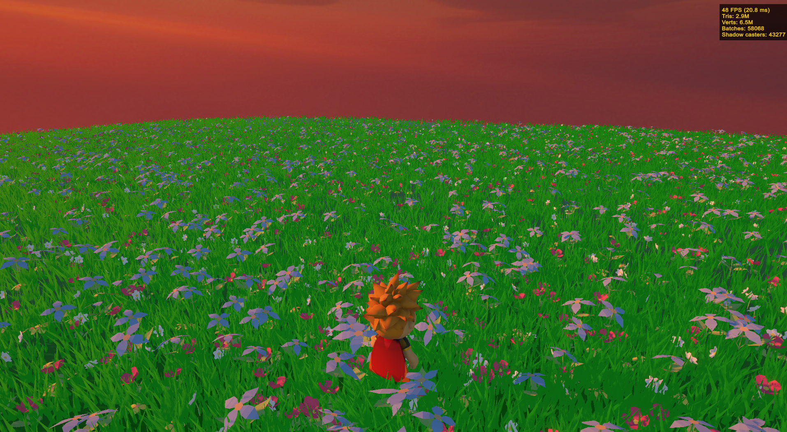
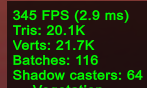
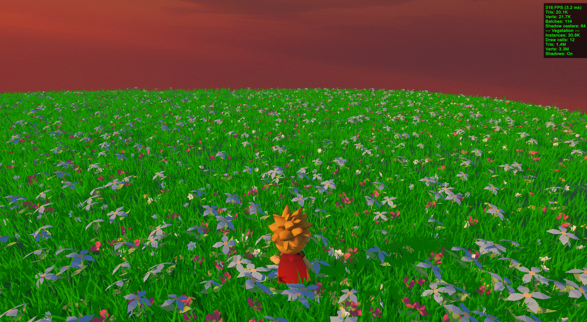
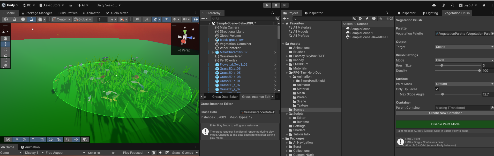

# AI for Developers – January 2026

## Individual Project Assignment

## Project Description

This project is a vegetation rendering and editing system for Unity (URP). It solves the problem of efficiently rendering tens of thousands of grass and flower (or any game objects really) instances with wind animation and player interaction, while providing user-friendly editor tools for painting, baking, and editing vegetation.

After painting vegetation onto any mesh surfaces with a configurable brush tool, the user can bake all instances into a compact ScriptableObject asset. A GPU indirect rendering pipeline then draws everything with compute-shader-based frustum and distance culling. A custom HLSL wind shader adds multi-layered vertex displacement with height-based masking, and a WindController drives real-time player interaction so grass bends away as the player walks through it. A dedicated instance editor allows selecting, moving, rotating, scaling, and deleting individual baked instances in Play mode with mesh-level raycasting precision.

**Integration:** The system uses Unity's `Graphics.RenderMeshIndirect` API with a compute shader for GPU-side culling, rendering ~30,000 vegetation instances across 19 mesh types at ~7 draw calls (down from ~31,873 as individual GameObjects).

## System Architecture – Modules

The system is organized into five modules that cover the full workflow from authoring to GPU rendering (paint → animate → optimize → bake → edit):

1. **Vegetation Palette & Brush** – Approach: provide a user-friendly editor tool for painting vegetation onto mesh surfaces with configurable density, radius, and randomization via a ScriptableObject-based palette with separate grass/flower collections.
2. **Wind & Interaction Shaders** – Approach: add natural-looking vertex-level procedural wind animation and player proximity interaction to all vegetation via custom HLSL shaders and a global WindController, without per-object configuration.
3. **GPU Indirect Rendering** – Approach: replace tens of thousands of individual GameObjects with a GPU indirect rendering pipeline using `Graphics.RenderMeshIndirect` and a compute shader for frustum + distance culling, reducing draw calls from ~31,873 to ~7.
4. **Bake Pipeline** – Approach: convert scene GameObjects into a compact ScriptableObject asset for GPU consumption, and support direct brush-to-bake painting with live GPU buffer hot-reload. In addition to that the baking process supports automatic setup of the mesh-to-indirect materials mappings.
5. **Instance Editor** – Approach: enable selecting, moving, rotating, scaling, painting new data directly into the baked ScriptableObject via a separate mode on the brush too, and deleting individual baked vegetation instances in Play mode (Play Mode restriction exists only because GPU instancing is only running when the game is actually running) using mesh-level raycasting and transform handles that write back to the ScriptableObject.

**AI assistance (all modules):** Claude Code was used exclusively across all modules, leveraging its codebase awareness (reading `.cs`, `.shader`, `.compute`, `.asset` files in the same session), web research integration, and iterative session-based workflow. Unity MCP (Model Context Protocol) was used for initial scene setup and visual verification.

## Development Process per Module

**Overview:** Development spanned 17 Claude Code sessions over 4 days (February 3 – February 7, 2026). The system grew organically from a simple brush tool for scene decoration into a full GPU-accelerated rendering pipeline as performance requirements emerged. The brush and palette were built first to establish the authoring workflow, followed by wind shaders to bring the vegetation to life visually. When thousands of painted instances caused severe frame drops, the GPU indirect renderer and bake pipeline were introduced after extensive AI-lead reserach. The instance editor came last as a quality-of-life tool for post-bake corrections. Throughout development, a visual feedback loop drove iteration: implement a feature, test it live in Unity's Scene/Play view, report issues, and iterate until the result looked and performed correctly. 

The overall testing strategy looked as follows:
- Take a baseline reading of FPS/rendered triangles and verticess, shadow casters and batch draw calls to the GPU
- Take a reading of the same data with the raw game object based version of the vegetation system
- Take a reading of the same data with the vegitation after baking and using GPU instancing and batched GPU rendering

### Module 1 – Vegetation Palette & Brush

**Approach & reasoning:** prioritize a user-friendly brush tool so vegetation can be painted interactively onto any mesh surfaces rather than placed manually, establishing the authoring foundation for all other modules.

**Step-by-step workflow:** research brush tool patterns for Unity mesh surfaces online, scaffold the core brush with raycast-based placement and circle preview, iterate on the VegetationPalette ScriptableObject for separate grass/flower collections with global randomization controls. The distinct separation of grass and flowers allowed for the tool to automatically map meshes to indirect render matrials, which was a huge quality of life improvement. Furthermore a line-drawing mode feature was introduced, as well as OnlyUpFace surface filtering to ensure vegetation was only places on the top side of the given mesh, and layer mask support was added to ensure only the desired layers were available for drawing. A custom Inspector with reorderable lists was built for the palette ScriptableObject.

**Testing strategy:** Since this is a editor based too, the main for of testing was visual testing in the Unity Scene view – painting on platforms and verifying density, randomization, and variety looked natural. Checked edge cases like painting on slopes and on wrong layers.

**AI tool choice:** Claude Code for its ability to read Unity project files, understand the project structure, and perform extensive research on best practices and high-qiality apporaches for building the tool.

**Key prompts:** see `vegetation_brush_design`, `palette_rework`, and `brush_surface_filtering` below.

### Module 2 – Wind & Interaction Shaders

**Approach & reasoning:** static grass looked lifeless, so the goal was to add natural-looking procedural wind animation to all vegetation without per-object configuration, using a custom HLSL vertex shader with height-based masking so blade bases stay fixed while tips sway.

**Step-by-step workflow:** research efficient wind techniques for Unity URP online, investigate the actual materials/prefabs used by the vegetation palettes, implement initial translation-based wind (which looked wrong – grass "slid" on the ground), iterate to rotation-based bending with height masking, add player interaction with directional grass bending, and create a WindController MonoBehaviour for runtime parameter control via global shader properties.

**Testing strategy:** live visual testing in Play mode – verified wind looked natural from multiple camera angles, confirmed grass bases stayed anchored, tested player interaction by walking through grass patches and checking directional correctness.

**AI tool choice:** Claude Code for its ability to read Unity `.asset` files to discover actual material references and search online for URP-compatible HLSL wind techniques and SRP Batcher compatibility requirements.

**Key prompts:** see `wind_research`, `wind_bending_fix`, and `player_interaction` below.

### Module 3 – GPU Indirect Rendering

**Approach & reasoning:** after populating the scene with ~31,873 vegetation GameObjects, performance dropped severely. Initial quick-fix attempts failed (removing shadows looked terrible, GPU Instancing was incompatible with LODGroups). The solution was to eliminate all GameObjects and replace them with `Graphics.RenderMeshIndirect` – storing transforms in GPU buffers (which allows the GPU to render the same game object multiple times extremely efficiently in one pass) and using a compute shader for frustum + distance culling.

**Step-by-step workflow:** Perform extensive research on grass rendering (and general multi-instace optimizations) online, document why initial quick-fix attempts failed, design the full GPU indirect pipeline (ScriptableObject for baked data, compute shader for culling, indirect shader for rendering), implement 8 files across the pipeline, then iteratively debug lighting issues (grass not receiving sunlight) and bake quality problems (incorrect placement, flower color loss, missing instances, losing rotations and scaling).

**Testing strategy:** compared visual output before/after baking, verified instance count in baked data matched source (~31,873 instances across 19 mesh types), checked culling by moving the camera and verifying smooth instance appearance/disappearance, profiled draw call count to confirm reduction.

**AI tool choice:** Claude Code – the most technically demanding module, requiring it to generate compute shaders (HLSL), URP-compatible surface shaders with StructuredBuffer reads, and the C# rendering code that ties them together, while reasoning about multiple interdependent files simultaneously.

**Key prompts:** see `grass_optimization_research`, and `shader_lighting_fix` below.

### Module 4 – Bake Pipeline

**Approach & reasoning:** the bake pipeline serves two purposes – converting existing scene GameObjects into the optimized GrassInstanceData ScriptableObject, and allowing the vegetation brush to paint directly into baked data without spawning intermediate GameObjects. In addition to that the fact that the data is baked in to an SO and doesn't comprise of actual game objects significantly improved scene loading times as the raw text data for the SO can be compressed more easily and the runtime engine doesn't have to load each object in to the game view.

**Step-by-step workflow:** create GrassDataBaker as an Editor window that scans a container, maps prefab meshes to type indices, and writes the ScriptableObject. After the GPU renderer was working, add the brush-to-bake pipeline (BakedDataPaintTarget) with GPU buffer hot-reload so changes appear immediately. The baking process can generate the needed mappings for mesh to indirect rendering material to minizine the needed setup.

**Testing strategy:** verified bake output via console logs (31,873 instances across 19 mesh types), create a custom script that cross-referenced baked data with the actual source GameObjects to ensure their key properties were kept correctly, tested brush-to-bake by painting in play mode and confirming new instances appeared in the GPU-rendered output instantly.

**AI tool choice:** Claude Code for its ability to read palette assets (`.asset` YAML files) and trace GUID references to actual prefab meshes for building correct mesh-type mappings.

**Key prompts:** see `bake_rendering_investigation` and `brush_to_bake` below.

### Module 5 – Instance Editor

**Approach & reasoning:** after baking, individual vegetation instances needed manual adjustment (some placed outside platforms, others needing rotation/scaling). Since baked instances aren't GameObjects, a custom editor was needed. This was the second most challenging module – it required 4 sessions including recovering from D3D12 GPU crashes.

**Step-by-step workflow:** initial design rendered baked instances in Scene view with click-to-select, which crashed Unity due to `Graphics.DrawMeshInstanced` being called during IMGUI pass on D3D12. Attempted fix (moving rendering to `beginCameraRendering`) still crashed. Complete redesign to work in Play mode where GrassRenderer already handles rendering, adding raycasting against baked instance bounds for selection. Then improved click precision by switching from bounding box raycasting to mesh-level raycasting for dense areas. The instance editor uses ghost object that are created, so that the GPU doesn't have to re-render the baked data and the ghost object is persisted when the user is done editing the specific grass instance. This allowed for very fast and easy edits as the ghost objects behaved like any unity game object and no additional logic was need to create the handle based editing.

**Testing strategy:** tested select/move/rotate/scale/delete operations, verified ghost objects matched source transforms, tested in dense areas to ensure correct instance selection, tested domain reload and play mode transitions for crash safety.

**AI tool choice:** Claude Code – the D3D12 crash diagnosis required reading Unity crash logs from dump files, researching error codes online (`DXGI_ERROR_DEVICE_REMOVED / 887a0005`), and understanding D3D12 command buffer state.

**Key prompts:** see `instance_editor_design`, `editor_play_mode_redesign`, and `picker_precision` below.

---

### Key Prompts

#### `vegetation_brush_design`
*Session 2 – 2026-02-03*

> i want you to create plan about implementing a simple vegetation brush -> it should support grass prefabs as inputs, also flowers. Each needs to have randomization settings, like rotation and scale, as well what are the chances to place a flower so it can be more grassy or more flowery. The brush should be usable on a mesh, not on terrain, ideally in the scene editor. When using the brush i want to see a circle on the ground where things will be placed. It needs to have configurable density and size and for now just make it circular. Before you begin - RESEARCH ONLINE on how to approach this correctly cause we need to base it on a solid baseline design to iterate properly on it. We don't need industrial grade implementations, just keep it simple for now

#### `palette_rework` (*Session 2 – 2026-02-03*)

> Rework the SO to be more user friendly - I want it to have seprate grass/flowers prefabs on purpose. I want global controls for grass/flowers isntead of having to manually setup each one. I also want you to put good defaults for both. By default all items in the two collection should have an evenly spread distribution, but allow for customization. The other things liek rotation, titlt, scale should also be global for both colelctions (grass/flowers) and i want good default there too.

#### `brush_surface_filtering` (*Session 4 – 2026-02-06*)

> I want you to plan an extension of the vegitation brush. Fist you are required to get extrememly well familiar with it. Then i want you to make it so it has two extra optional settings -> OnlyUpFace, meaning it should only draw on meshes' up side, my platforms have a bit of a slope on the side and the brush currently sometimes paints on it and it's annoying clean up. The other options is layer mask - i want you to make it so i can choose which layers it draws on. sometimes it spawns stuff on npcs and bushes. These two settigns should work together or separately with no issues and shoud integrate nicely in the current solution

#### `wind_research` (*Session 3 – 2026-02-05*)

> i have a few hundred grass objects + flowers in my intro scene. I want you to perform deep online research on efficient ways to add "wind" to it, so it isnt so static and feels more alive. Ideally i wont have to replace all grass or have to configure each piece separately but let's just get something working first. Inspect the scene via the .unity file to get a better idea of what is there, the vibe and the type of prefabs/veg objects we have

#### `wind_bending_fix` (*Session 3 – 2026-02-05*)

> It's a start. Plan an improvement - make it more like real wind where the blades of grass dont just sway like they are on a sine wave, but bend to it a bit, currently they MOVE on the ground, the bottom of the blades should stay put where it is and only the upper bits of the blades/flowers are affected

#### `player_interaction` (*Session 3 – 2026-02-05*)

> Now that we have that in somewhat working order, plan another exapansion of hte feature - i want the grass to be ruffled when the player passes through it, It should make sense direction wise based on where the player is and how the blade itself is positioned relatively

#### `grass_optimization_research` (*Session 7 – 2026-02-06*)

> This task is of the utmost importance. I want you to perform an extensive research. I've used the VegetationBrush and it's related objects and have a lot of grass in the scene to the point it's starting to lag a bit. The problem is i really like how it looks. Your task is to look at the full grass system we have with swaying in the wind and player rustling and everything and research and plan optimizations to make this less laggy while still keeping the dense grass look. If there are better overall solutions that require a more major rework of the grass system i am down as long as it keeps the dense look with optimized performance. USE AS MANY RESOURCES AS YOU PLEASE, I DONT MIND PAYING EXTRA FOR THIS QUERY, research, look for info, analyze before making any changes.

#### `shader_lighting_fix` (*Session 8 – 2026-02-06*)

> The grass is rendered but isnt receiving light from the sun, plan a way to introduce that

#### `bake_rendering_investigation` (*Session 9 – 2026-02-06*)

> I want you to take a very deep look at the current grass baker and renderer and the shaders involded with indirect rendering and analyze the following issue - when i baked and setup the renderer - seeming all data is baked and in the SO (~31k items) but when actually rendering not all of it is there and it's placed wrong and some flowers are ther which arent in the regular gameobject setup and flwoers lose shape, color. Im not sure if the baking is too rudimentary or if the renddering is wrong but you need to analyze this and come up with a plan to upgrade the rendered and/or baking to keep the look the same. Look at the vegetation brush settings and how it places veg, specifically its randomization params to see what we need to keep in the bake and render later. !!THIS IS JUST A THEORY I HAVE, DO A PROPER INVETIGATION AND DONT TAKE MY WORD AS GOSPEL

#### `brush_to_bake` (*Session 15 – 2026-02-07*)

> I want you to investigate in complete depth - the vegitation brush, the grass baker, renderer and isntance editor. Then i want you to plan the implementation of the following feature -> i want the vegitation brush to be usable on the baked data directly similar to how editing it works via the editor - so in play mode i can turn on the brush and it can have a toggle/setup to put stuff in a baked data SO isntead of on the scene directly. Pay attention to how stuff is re-rendered and such cause this may cause a gpu usage spike and we dont want crashes

#### `instance_editor_design` (*Session 11 – 2026-02-07*)

> This is an extremely complex task and required precision and dilligence. I want you to look at the entire grass system we have - bakign and rendering and everything related. Then i want you to come up with an easy, visual way for me to edit/remove single assets from the bake - the problem is some of them are placed a little outside the platform and i want o manualyl be able to adjust them. Ideally this will control as if they're game objects - i'd be able to click to select and then move/rotate/scale/delete them. Think hard cause the runtime redered objects arent actually there in the scene - we will either need to do this in play mode or have special way of rendering the grass even when not in play mode. USE AS MANY RESOURCES AS YOU PLEASE, I DONT MIND PAYING EXTRA FOR THIS QUERY, reserach, look for info, analyze before deciding on aything.

#### `editor_play_mode_redesign` (*Session 13 – 2026-02-07*)

> No, still crashes. I want you to plan a complete redesign - i want it to work in play mode when the grass is already being rendered, so I want to be able to click on a piece of grass (probably in scene view?, but reasearch wahtveer works better) and just edit positon rotation scale and delete it. Research online on how to achieve this cause right now in playmode in the scene view the grass is visible but not clickable + im not sure how editing it runtime is gonna work. this needs quality research behind it. USE AS MANY RESOURCES AS YOU PLEASE, I DONT MIND PAYING EXTRA FOR THIS QUERY, reserach, look for info, analyze before making any decisions.

#### `picker_precision` (*Session 14 – 2026-02-07*)

> okay worked, but now i want you to investigate this problem both here and online -> in dense areas of grass its almost impossible to pick the one i want. Is it possible to have the clickabble area be closer to the actual mesh isntead of just a bounding box. If not think like a designer and propose solutions to get around this. USE AS MANY RESOURCES AS YOU PLEASE, I DONT MIND PAYING EXTRA FOR THIS QUERY, reserach, look for info, analyze before making any decisions

---

## Challenges & Tool Comparison

I used Claude Code exclusively for all development. The biggest challenge was the D3D12 GPU crash when building the instance editor (Module 5) – calling `Graphics.DrawMeshInstanced` during Unity's IMGUI pass caused an unrecoverable device error (`DXGI_ERROR_DEVICE_REMOVED`) that required a complete architectural redesign to work in Play mode instead. The GPU indirect rendering pipeline (Module 3) was the most technically demanding module overall, requiring compute shaders, custom URP-compatible indirect shaders with manual lighting, and iterative debugging of lighting integration (the grass initially rendered pitch black). Claude Code's cross-file reasoning (reading `.shader`, `.compute`, `.cs`, `.asset`, and crash dump files in a single session) and integrated web research were essential for these challenges. Unity MCP was used for initial scene setup and visual verification via direct Unity Editor manipulation.

### Potential further improvements
- Automatic generation of the indirect materials based on the source shader/material
- Distance based shadow casting
- Dynamic groups of prefabs so they're not just "grass" or "fowers" even though this tool can be used with any prefab
- Indirect shaders to support more of the baseline URP/Lit shaders properties like metallic, occlusions, normal maps

## Working System Evidence
Short demo video available in [handover-files/2026-02-19 23-21-55.mkv](handover-files/2026-02-19%2023-21-55.mkv)
Running the sample scene WITHOUT GPU instancing and baking:

Runnig the sample scene WITH GPU instancing and baking:

Using the brush tool:

## Repository

**[https://github.com/KiroKirilov/UnityVegitationForDummies](https://github.com/KiroKirilov/UnityVegitationForDummies)**

The vegetation system source code is located under:
- `Assets/Scripts/Runtime/` – Runtime (GrassRenderer, GrassInstanceData, WindController, VegetationPalette)
- `Assets/Scripts/Editor/` – Editor tools (Baker, Brush, Instance Editor)
- `Assets/Shaders/` – Wind shaders and compute shader
- `Assets/Brushes/` – Palette and baked data ScriptableObject assets
- Project includes two demo scenes - `SampleScene` uses just the brush to draw a field of grass/flowers and `SampleScene-BakedGPU` uses the same baseline vegetation but uses the baking mechanism and GPU instancing to singnificantly boost performance and reduce draw calls